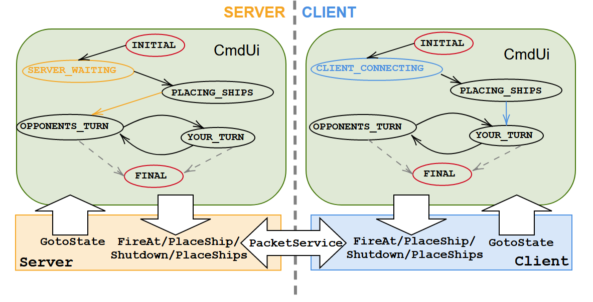

# Battleships
Simple Battleship game with an interactive command-line UI.

# Overview
This application is mostly driven by the actions that happen in the UI. The UI registers some event, it notifies the logic behind, the logic handles it and commands the UI what to do next. Occasionally the logic can send direct commands to the UI (things like Shutdown etc.).

The UI has defined states that it switches between (the switch itself is always provided as a command from the logic). It can ever only be in exactly one state in every moment. 

This diagram shows the big picture of the whole application. The names visualised in it correspond to the classes/enums/methods inside the code so it should help you to better understand and navigate in the code.

# Build
Open the Visual Studio solution, build and run using the desired configuration.